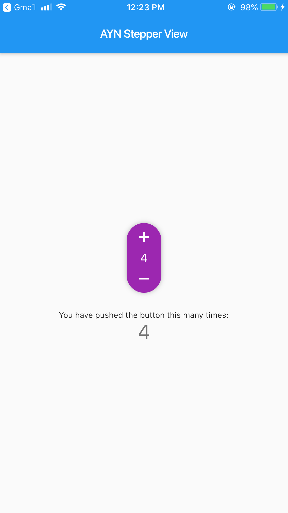

# ayn_stepper

A fully customizable Flutter Widget to get count. It can be applicable in e-commerce apps for getting cart count.




## Using
Create a widget to load and edit an image:
```dart
Widget _buildStepper() {
  return AYNStepperView(
               count: _counter,
               activeForegroundColor: Colors.purple,
               didChangeCount: (count) {
               setState(() {
                _counter = count;
               });
             },
          );
}


```


